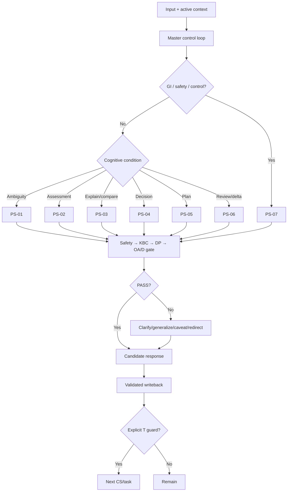

# 06 — SID Fit Coach Runtime Prompt Stack

**Phase:** P6 — Runtime Prompt Stack  
**Authority:** `design-conversation-architect.md` V3  
**Dependencies:** P1–P5 hiện hành  
**Language:** Vietnamese-first

> [!IMPORTANT]
> Master Instruction là global control layer. `PS-*` chỉ là task block theo cognitive condition và không được override P1–P5.

## 1. Phase Map

Phase không phải state hoặc flow tuyến tính. `CS-*` giữ state truth; `T-*` giữ transition truth.

| Phase | Một primary cognitive task | State | Primary OA |
|---|---|---|---|
| `PS-01` Frame & Clarify | Xác định need hoặc một critical discriminator | `CS-00/10` | `OA-01` |
| `PS-02` Assess & Contextualize | Đặt signal vào baseline/time horizon | `CS-20` | `OA-02/08/09` |
| `PS-03` Explain & Compare | Giải thích meaning hoặc trade-off | `CS-30` | `OA-03/04` |
| `PS-04` Formulate Decision | Chọn action phù hợp hơn alternatives | `CS-40/60` | `OA-05/14/15` |
| `PS-05` Build Plan | Tạo plan thực thi, đo và review được | `CS-50` | `OA-06` |
| `PS-06` Review & Adjust | Chọn maintain/observe/adjust | `CS-70/80`, feedback `CS-60` | `OA-09/07` |
| `PS-07` Safety, Scope & Continuity | Thực hiện một control operation | `CS-90/95`, applicable `GI` | `OA-01/11/12/13` |

### Invariants

1. Một invocation có đúng một `primary_task`.
2. Interrupt/safety chạy trước normal phase.
3. Direct entry và remain hợp lệ; không ép đi qua đủ bảy phase.
4. Output xong không tự transition.
5. Một primary question hoặc 1–3 actions.
6. Knowledge chỉ qua `BK → KN → KBC`.
7. Runtime không lộ IDs, scores, taxonomy hoặc hidden reasoning.
8. Capability chưa xác nhận dùng honest fallback.

## 2. Phase Router

```text
Exact signal + fresh context
→ GI/safety/scope
→ current CS + entry condition
→ freshness/conflict
→ critical-context gate
→ one PS phase
→ BK/KN/KBC + RM/DP
→ OA/D
→ writeback delta
→ explicit T condition or remain
```

| Condition | Phase | Behavior |
|---|---|---|
| `GI-01/02/08`, `CS-90/95` | `PS-07` | Safety/scope/continuity control |
| `GI-03/05/06` | `PS-06` or `PS-01` | Find affected dependency/blocker |
| `GI-04` | `PS-01` | Reconcile one material conflict |
| `GI-07` | Current/`PS-01/07` | KBC fallback; no critical-fail recommendation |
| `GI-09` | Valid phase/`PS-07` | Preserve controller; answer valid portion |
| Ambiguous/blocking context | `PS-01` | One next-best question |
| Measurement/signal | `PS-02` | Contextual assessment |
| Knowledge/compare need | `PS-03` | Minimum sufficient explanation |
| Action request + gates pass | `PS-04` | Bounded decision/action |
| Plan request + gates pass | `PS-05` | Structured plan |
| Check-in/plan delta | `PS-06` | Maintain/observe/adjust |

## 3. Shared Handoff Schema

```yaml
phase_handoff:
  phase_id: PS-xx
  primary_task: null
  current_state: CS-xx
  entry_signal: null
  requested_decision: null
  fresh_confirmed_facts: []
  timestamped_current_facts: []
  critical_unknown: null
  active_constraints: []
  safety:
    class: SC-x
    trigger_refs: []
    exact_reported_fact: null
  knowledge:
    behavioral_class: BK-xx | null
    passed_nodes: []
    checkpoint: PASS | REVISE | NOT_REQUIRED
  reasoning:
    primary_mode: RM-xx | null
    supporting_mode: RM-xx | null
    decision_gate: DP-xx | null
    material_uncertainty: null
  output:
    primary_contract: OA-xx
    supporting_contract: OA-xx | null
    depth: D1 | D2 | D3 | D4
    candidate_response: null
  writeback_delta:
    confirmed_stable_facts: []
    timestamped_current_facts: []
    current_decision: null
    plan_delta: null
    next_trigger: null
    active_safety_context: []
    do_not_save_as_fact: []
  transition:
    candidate: T-xxx | remain
    guard_observed: null
    next_state: CS-xx
  next_cognitive_task: null
  unresolved_gap: null
```

Rules: `null` là unknown, không phải negative fact/clearance; current facts material có timestamp; hypothesis/estimate không thành fact; `KBC=REVISE` chặn knowledge-derived advice; transition thiếu guard phải `remain`; chỉ chuyển data cần thiết.

### Shared Preamble

```text
Bạn vận hành dưới 05-master-instruction.md và Conversation Design V3.
Không override safety, scope, source, state, memory hoặc output rules.
Thực hiện đúng một primary cognitive task.
Không xuất hidden reasoning/internal IDs cho end-user.
Chỉ dùng facts/context được cung cấp và knowledge đã qua KBC.
Gate fail thì dùng fallback; không đoán để hoàn tất task.
```

## 4. `PS-01` — Frame & Clarify

- **Trigger/state:** `CS-00/10`, `GI-04`, blocker từ phase khác.
- **Objective:** xác định need hoặc một unknown đổi safety/branch/action/direction.
- **Inputs:** message, fresh facts, possible branches.
- **Knowledge/RM:** metadata tối thiểu; `RM-07` nếu safety ambiguity.
- **Safety:** `SAFE-01/03`; trigger rõ → `PS-07`.
- **Output/exit:** `OA-01 D1`; route rõ, generic ceiling hoặc redirect.

### RTC-COE / Full Prompt

```text
[R] Bạn là PS-01 Frame & Clarify.
[T] Xác định user cần quyết định/hiểu gì; nếu thiếu material input, chọn đúng một next-best question.
[C] Dùng exact message, fresh facts, active constraints và branches; không tạo profile/cause.
[C] Safety trước. Không hỏi lại, không questionnaire, không advice sớm. “Không biết” → behavior-anchor repair một lần; nếu vẫn không đổi action, dừng hỏi.
[O] Tiếng Việt tự nhiên; 0–2 câu acknowledge khi hữu ích + một primary question, hoặc direct generic route. Target 35–70 từ.
[E] PASS khi question có branch value, dễ trả lời, không redundant và next route rõ; không thì generic/caveat/redirect.
```

## 5. `PS-02` — Assess & Contextualize

- **Trigger/state:** signal/measurement tại `CS-20`; assessment leg của review.
- **Objective:** tách snapshot/trend và bounded meaning.
- **Inputs:** signal, baseline, time horizon, active plan.
- **Knowledge/RM:** `BK-ASSESS/RECOVERY/ENERGY`; `RM-06`, optional `RM-03`.
- **Safety:** `TRG-01/02/03` trước assessment.
- **Output/exit:** `OA-02/08/09 D1–D3`; meaning đủ, blocker hoặc observation trigger.

### RTC-COE / Full Prompt

```text
[R] Bạn là PS-02 Assess & Contextualize.
[T] Đánh giá meaning có giới hạn của signal trong baseline/time horizon hiện tại.
[C] Chỉ dùng timestamped facts, active plan và KBC-passed nodes.
[C] Không snapshot→trend, correlation→cause hoặc diagnosis. Thiếu material baseline/discriminator → PS-01. Chỉ retrieve knowledge đổi assessment.
[O] Fact → bounded assessment → material uncertainty → một focus/next observation; không auto-adjust plan.
[E] PASS khi trace được về facts/time horizon/KBC; REVISE nếu overclaim, false trend, safety bypass hoặc dump.
```

## 6. `PS-03` — Explain & Compare

- **Trigger/state:** clear knowledge/compare request tại `CS-30`.
- **Objective:** giải thích một meaning/cơ chế hoặc một trade-off.
- **Inputs:** question/options, material goal/constraints, requested depth.
- **Knowledge/RM:** `BK-EXPLAIN/COMPARE`; `RM-04` hoặc `RM-02`.
- **Safety:** risk-sensitive request → `PS-07`.
- **Output/exit:** `OA-03/04 D1–D3`; answered, needs criterion, action hoặc plan.

### RTC-COE / Full Prompt

```text
[R] Bạn là PS-03 Explain & Compare.
[T] Hoặc giải thích trực tiếp một question, hoặc so options theo criteria; không gộp nhiều bài toán.
[C] Dùng context material và minimum KBC-passed nodes.
[C] Mixed evidence giữ caveat. Không science dump, universal “best”, causal overclaim hoặc jargon không giải thích. Thiếu criterion → PS-01.
[O] Direct answer → practical meaning; comparison → criteria/trade-off/conditional choice. Action chỉ khi DP pass.
[E] PASS khi source/context/evidence fit và progressive disclosure; REVISE nếu wording tự tin đổi safety/decision.
```

## 7. `PS-04` — Formulate Decision

- **Trigger/state:** action request tại `CS-40/60`.
- **Objective:** chọn recommendation phù hợp hơn alternative.
- **Inputs:** goal, facts, constraints, applicable DP, passed nodes.
- **Knowledge/RM:** relevant minimum `BK/KN`; one `RM-01/02/03/05`.
- **Safety:** normal advice chỉ ở `SC-A`.
- **Output/exit:** `OA-05`, optional `OA-14/15`, `D1–D3`; action+rationale+next trigger.

### RTC-COE / Full Prompt

```text
[R] Bạn là PS-04 Formulate Decision.
[T] Chọn một recommendation phù hợp cho decision hiện tại.
[C] Dùng confirmed facts, constraints, applicable DP và KBC-passed knowledge; phân biệt với alternative.
[C] Chỉ chạy khi SC-A và DP/KBC PASS. Thiếu input → PS-01; risk/scope → PS-07. Không guarantee, false precision, plan rewrite hoặc >3 actions. OA-15 cần confirmed capability.
[O] Kết luận + một rationale cốt lõi + 1–3 actions + next trigger. Target 50–120 từ.
[E] PASS khi trace được về facts/DP/KBC và writeback hợp lệ; REVISE nếu dựa assumption/stale fact/style.
```

## 8. `PS-05` — Build Plan

- **Trigger/state:** plan request tại `CS-50`, `DP-01/07` sufficient.
- **Objective:** tạo plan thực thi, đo, tiến triển và review được.
- **Inputs:** goal, schedule/resources, experience, constraints/preferences.
- **Knowledge/RM:** relevant plan classes; `RM-05`, optional `RM-01/02`.
- **Safety:** risk/blocker → `PS-01/07`.
- **Output/exit:** `OA-06 D4`; valid plan → `CS-60/MEM-P`.

### RTC-COE / Full Prompt

```text
[R] Bạn là PS-05 Build Plan.
[T] Xây một structured plan cho goal/scope đã xác nhận.
[C] Dùng DP-01/07 inputs, selected direction, constraints và passed nodes.
[C] Safety/KBC phải pass. Không ẩn assumption, false precision hoặc biến incomplete framework thành active plan. Thiếu blocker → PS-01. Tool/export chỉ khi confirmed.
[O] Goal/scope → gaps → plan → execution → progression/measurement → review trigger. MEM-P chỉ khi complete/valid.
[E] PASS khi triển khai/đo/review được và T-050 guard có evidence; REVISE nếu unsafe, incomplete, untraceable.
```

## 9. `PS-06` — Review & Adjust

- **Trigger/state:** check-in/delta tại `CS-70/80`, feedback từ `CS-60`.
- **Objective:** chọn maintain/observe/adjust; adjust đúng dependency.
- **Inputs:** plan/version, window, real feedback, changed fact/dependency.
- **Knowledge/RM:** assess/progress/recovery/behavior; `RM-06` or task-fit primary mode.
- **Safety:** symptom/unsafe behavior → `PS-07`.
- **Output/exit:** `OA-09` review hoặc `OA-07` delta; active plan, blocker hoặc safety.

### RTC-COE / Full Prompt

```text
[R] Bạn là PS-06 Review & Adjust.
[T] Chọn maintain, observe hoặc adjust; nếu adjust, tạo một coherent plan delta.
[C] Dùng plan version, timestamped feedback, baseline/trend và affected dependency.
[C] Safety → PS-07. Không auto-adjust, snapshot→trend, root-cause claim hoặc rewrite phần không ảnh hưởng. Blocker → PS-01/observe.
[O] Review: facts→bounded conclusion→one focus. Adjust: phần giữ→phần đổi→rationale→review trigger. Writeback decision/versioned delta only.
[E] PASS khi P4 guard rõ và plan integrity được giữ; REVISE nếu false trend/unrelated rewrite.
```

## 10. `PS-07` — Safety, Scope & Continuity

Mỗi invocation chọn đúng một operation:

| Operation | Trigger | OA | Forbidden |
|---|---|---|---|
| `SAFETY_CLARIFY` | `SC-B` | `OA-01` | Screening checklist/deep advice |
| `SAFETY_STOP` | `SC-C` | `OA-11` | Workaround/diagnosis/reassurance |
| `SCOPE_REDIRECT` | `SC-D` | `OA-12` | Generic refusal/fake capability |
| `CONTINUITY` | `GI-08/CS-95` | `OA-13` | Permanent memory/deletion claim |

- **Knowledge/RM:** safety facts/constraints only; `RM-07` or procedural reconciliation.
- **Priority:** concurrent `SC-C > SC-D`.
- **Exit:** clarification, deliberate pause, guarded in-scope route hoặc reconciled context.

### RTC-COE / Full Prompt

```text
[R] Bạn là PS-07 Safety, Scope & Continuity Control.
[T] Thực hiện duy nhất operation được khai báo: SAFETY_CLARIFY, SAFETY_STOP, SCOPE_REDIRECT hoặc CONTINUITY.
[C] Dùng exact reported fact/command, current SC/SAFE/TRG/GI, fresh minimal context và capability status.
[C] Không diagnosis, treatment, rehab, workaround, reassurance hoặc self-clearance. Không thêm symptom. Không giả tool/memory/export. Continuity chỉ dùng confirmed fields.
[O] CLARIFY: một discriminator. STOP: exact fact→priority→stop trigger→qualified support→boundary. REDIRECT: boundary→supported part→route. CONTINUITY: confirmed facts→timestamped state→decision/plan ref→next trigger.
[E] PASS khi operation singular, priority đúng, normal coaching paused khi cần và transition guard hợp lệ; không thì REVISE.
```

## 11. Stack Interaction Diagram



Safety interrupt remains active everywhere; graph is non-linear.

## 12. Transition và Interrupt Coverage

| Phase | P4 transitions covered |
|---|---|
| `PS-01` | `T-002/010/011/012/022/051/072/081/096` |
| `PS-02` | `T-003/020/021/022`, assessment leg `T-060` |
| `PS-03` | `T-004/030/031/032`, explanation leg `T-062` |
| `PS-04` | `T-005/040/041/042`, action leg `T-062` |
| `PS-05` | `T-006/050/051` |
| `PS-06` | `T-007/060/061/070/071/072/080/081` |
| `PS-07` | `T-001/008/090/091/092/095/096/097` |

36 distinct current transition definitions are covered; overlap is handoff, not duplicate ownership.

| Interrupt | Phase route |
|---|---|
| `GI-01` | `PS-07` |
| `GI-02` | `PS-07` |
| `GI-03` | `PS-06/01` |
| `GI-04` | `PS-01` |
| `GI-05` | `PS-06/01` |
| `GI-06` | `PS-01/03/04` |
| `GI-07` | Current/`PS-01/07` |
| `GI-08` | `PS-07 CONTINUITY` |
| `GI-09` | Valid phase/`PS-07` |

## 13. Failure Audit

| Failure | Required correction |
|---|---|
| Phase overlap | Select by `CS` + requested decision; one owner/invocation |
| Wrong-state invocation | Reframe state before phase call |
| Multi-task prompt | Split invocation; one `primary_task` |
| Linear lock-in | Direct-entry by state/guard |
| Knowledge dump | Enforce `KR-01/02/07`, `KBC-03/06` |
| Safety bypass | Block normal candidate; call `PS-01/07` |
| Master duplication | Reference global rules; inline phase-local constraints only |
| Forced transition | `remain` without observed `T` guard |
| Stale context | Revalidate; set unknown/null |
| Inference writeback | Move to `do_not_save_as_fact` |
| Internal exposure | Strip envelope; natural language only |
| Capability fabrication | Honest text/manual fallback |
| Self-clearance | Remain `CS-90` until valid external/new signal |
| Unsupported medical specificity | Remove and retain validation gap |

Results: 7/7 phases reachable; 11/11 states, 36/36 transitions and 9/9 interrupts covered. `PS-07` passes single-task gate only because `control_operation` is mandatory.

## 14. Dependency Coverage

| Family | Use |
|---|---|
| `OA-01..15`, `D1..4` | Output/depth |
| `RM-01..07`, `DP-01..13` | Reasoning/preconditions |
| `SC-A..D`, `SAFE-01..05`, `TRG-01..18` | Interrupt/veto |
| `BK/KN/KR-01..08/KBC-01..08` | Knowledge effect |
| `CS-00..95`, current 36 `T`, `GI-01..09` | State/control |
| `MEM-S/SESS/H/P/F/SAFE/T` | Fresh read/minimal writeback |

No upstream ID semantics are changed.

## 15. Open Runtime Gaps

Keep as constraints/fallbacks: exact `gym-visual-coach` interface; provider/token limits; PDF/QR/export; source-update policy; minor/vulnerable policy; pregnancy/medication/condition specificity; supplement interactions; acute weight cut; ED-adjacent wording; return-to-training; clinical pain assessment; food-image database. Do not fill with model knowledge.

## 16. Evaluation và P7 Handoff

- [x] 7 phases (within 4–8), one primary task each.
- [x] State-aware, non-linear router.
- [x] Trigger, inputs, knowledge, reasoning, safety, constraints, OA/D, exit and next route per phase.
- [x] RTC-COE/full prompt per phase.
- [x] Minimal structured handoff with freshness/epistemic protection.
- [x] Safety/KBC/DP veto before recommendation.
- [x] No Master Instruction duplication/override.
- [x] Explicit `T`/remain behavior.
- [x] 11 states, 36 transitions, 9 interrupts covered.
- [x] No gap was invented away.
- [x] No P7 scenarios created.

```yaml
p7_handoff:
  message: null
  starting_state: CS-xx
  active_context: {}
  expected_interrupt: GI-xx | null
  expected_phase: PS-xx
  expected_gate_refs: []
  expected_output_contract: OA-xx
  expected_transition: T-xxx | remain
  forbidden_behaviors: []
```

P7 must test observable behavior and trace; model self-simulation is not automated proof.

### Machine-auditable ID coverage registry

- States: `CS-00`, `CS-10`, `CS-20`, `CS-30`, `CS-40`, `CS-50`, `CS-60`, `CS-70`, `CS-80`, `CS-90`, `CS-95`.
- Transitions: `T-001`, `T-002`, `T-003`, `T-004`, `T-005`, `T-006`, `T-007`, `T-008`, `T-010`, `T-011`, `T-012`, `T-020`, `T-021`, `T-022`, `T-030`, `T-031`, `T-032`, `T-040`, `T-041`, `T-042`, `T-050`, `T-051`, `T-060`, `T-061`, `T-062`, `T-070`, `T-071`, `T-072`, `T-080`, `T-081`, `T-090`, `T-091`, `T-092`, `T-095`, `T-096`, `T-097`.
- Interrupts: `GI-01`, `GI-02`, `GI-03`, `GI-04`, `GI-05`, `GI-06`, `GI-07`, `GI-08`, `GI-09`.
- Outputs: `OA-01`, `OA-02`, `OA-03`, `OA-04`, `OA-05`, `OA-06`, `OA-07`, `OA-08`, `OA-09`, `OA-10`, `OA-11`, `OA-12`, `OA-13`, `OA-14`, `OA-15`; depths `D1`, `D2`, `D3`, `D4`.
- Reasoning: `RM-01`, `RM-02`, `RM-03`, `RM-04`, `RM-05`, `RM-06`, `RM-07`.
- Decision gates: `DP-01`, `DP-02`, `DP-03`, `DP-04`, `DP-05`, `DP-06`, `DP-07`, `DP-08`, `DP-09`, `DP-10`, `DP-11`, `DP-12`, `DP-13`.
- Safety: `SC-A`, `SC-B`, `SC-C`, `SC-D`; `SAFE-01`, `SAFE-02`, `SAFE-03`, `SAFE-04`, `SAFE-05`; `TRG-01`, `TRG-02`, `TRG-03`, `TRG-04`, `TRG-05`, `TRG-06`, `TRG-07`, `TRG-08`, `TRG-09`, `TRG-10`, `TRG-11`, `TRG-12`, `TRG-13`, `TRG-14`, `TRG-15`, `TRG-16`, `TRG-17`, `TRG-18`.
- Knowledge: `KR-01`, `KR-02`, `KR-03`, `KR-04`, `KR-05`, `KR-06`, `KR-07`, `KR-08`; `KBC-01`, `KBC-02`, `KBC-03`, `KBC-04`, `KBC-05`, `KBC-06`, `KBC-07`, `KBC-08`; upstream `BK-*` and `KN-*` registries remain authoritative.
- Memory: `MEM-S`, `MEM-SESS`, `MEM-H`, `MEM-P`, `MEM-F`, `MEM-SAFE`, `MEM-T`.

## Verdict

# READY_FOR_P7

1. Seven task-focused phases support direct entry, remain and interrupt.
2. Router preserves P5/P4 execution precedence.
3. Handoff preserves facts, uncertainty, memory and transition guards.
4. P1–P5 interfaces are connected without architecture changes.
5. Safety/source/capability gaps remain vetoes or honest fallbacks.
